# Fabbro Knives

## Intro

Fabbro Knives is a B2C e-commerce website for the final project of the Code Institute diploma in Software Development.

The site provides role based permissions for users to interact with a central dataset. It includes user authentication, email validation and CRUD functionality for administrator users.

The payment system uses Stripe. Please note that this website is for educational purposes only and the payment gateway is not set up to accept real payments. Do not enter any personal credit/debit card details when using the site.

When testing the site, please use the following from Stripe's testing documentation:

- a Stripe test card number, such as 4242 4242 4242 4242, or 4000 0582 6000 - 0005 for UK.
- any future expiry date.
- any three-digit CVC.

You can visit Fabbro Knives by [clicking here](https://fabbro.herokuapp.com)


## Table of Contents

- [Business Plan](#business-plan)
- [Scope](#scope)
- [Structure](#structure)
- [Skeleton](#skeleton)
- [Surface](#surface)
- [Features](#features)
- [Testing](#testing)
- [Technologies Used](#technologies-used)
- [Deployment](#deployment)
- [Credits](#credits)


# UX

## Strategy

The main strategy is to target the niche audience who are passionate about cooking and love to use quality tools in their kitchen. Here are the following strategies that can help to grow the business:

- Create a user-friendly website: The website should be easy to navigate and visually appealing. It should provide a seamless shopping experience for customers, with clear product descriptions and high-quality images.

- Focus on quality products: Quality products are the backbone of any ecommerce business. It is important to ensure that the products being sold are of the highest quality and meet the expectations of the customers.

- Offer a wide range of products: Offering a variety of products such as different types of knives, cutting boards, pans and knife maintenance accessories will give customers more choices and increase the likelihood of them making a purchase.

- Use social media to promote products: Social media platforms such as Facebook, Instagram and Twitter can be used to promote products and engage with customers. This will help to build a community of loyal customers and increase brand awareness.

- Provide excellent customer service: Excellent customer service is key to the success of any ecommerce business. Providing prompt and helpful responses to customer inquiries and concerns can help to build a good reputation and increase customer loyalty.

- A newsletter can be an effective strategy to increase engagement with customers and keep them updated on new products, promotions, and industry news. By implementing a newsletter, an ecommerce business can increase customer engagement and retention, which can ultimately lead to increased sales and revenue.

## Business Plan

Fabbro Knives operates on a direct-to-consumer model, meaning that it sells its products directly to customers without the need for intermediaries. This allows it to offer competitive prices for high-quality products, as it is able to cut out the middleman and reduce costs.

The target audience consists of cooking enthusiasts, professional chefs, and anyone interested in high-quality kitchen products. We believe that our products are ideal for customers who value quality and durability, and are willing to invest in products that will last for years to come. We also aim to target gift buyers, as high-end kitchen products make for great gifts.

### Products

Our e-commerce store offers a wide range of products, including:

- Knives: Chef's knives, hunting knives, cleavers, and more.
- Pans: Saucepans, stainless steel, non-stick, and more.
- Cutting boards: High quality handmade wood boards and maintenance balm.
- Sharpeners: Compact sharpener and whetstones.
- Storage: Wood knife block and a magnetic holder.

All of our products are sourced from reputable brands and manufacturers, and are chosen for their quality and durability. We believe that our products are the best in the market, and we stand behind every product we sell.

### Pricing

Our pricing strategy is to be competitive with other high-end kitchen stores, while also taking into account the cost of sourcing and shipping our products. We regularly review our prices to ensure that they are in line with the market, and we offer occasional discounts or bundles to incentivize purchases.

### Marketing Strategies

We use a variety of marketing strategies to promote our e-commerce store and products:

- Social media: We maintain a presence on popular social media platforms such as Instagram, Facebook, and Twitter. We regularly post updates about new products, promotions, and events to engage with our audience and build our brand.
- Search engine optimization (SEO): We optimize our website to rank higher on search engines such as Google, so that customers can find us more easily when searching for kitchen products.
- Email marketing: We send regular emails to our subscribers to inform them of new products, promotions, and events. We also offer exclusive discounts to our email subscribers to encourage purchases.
- Paid advertising: We use paid advertising on platforms such as Google Ads and Facebook Ads to target customers who may be interested in our products. We regularly review the performance of our ads to ensure that they are effective.

### Conclusion

Thank you for considering Fabbro Knives for your kitchen product needs. We are committed to providing the best products and shopping experience for our customers, and we hope that you will enjoy shopping with us. If you have any questions or feedback, please don't hesitate to contact us.

## Scope

I used Github Projects with Agile methodology

### User Expectations

- As a user I expect the app to be accessible.
- As a user I expect my data to be secure.
- As a user I expect the app to be responsive.

### User Stories

- As a shopper, I want to be able to view a list of products so that I can select some to purchase.
- As a shopper, I want to be able to view individual product details so that I can identify price, description and image.
- As a shopper, I want to be able to see deals and offers so that I can save on products I want to purchase.
- As a shopper, I want to be able to view total of my purchase at any time so that I can avoid spending too much.
- As a shopper, I want to be able to sort the list of products so that I can identify products by different types of sorting.
- As a shopper, I want to be able to sort a specific category of products so that I can find best-priced/rated product in a specific category or sort them by name.
- As a shopper, I want to be able to search a product by name or description so that I can find a specific product.
- As a shopper, I want to be able to see what I've searched so that I can decide whether the product I want is available.
- As a shopper, I want to be able to select the quantity of a product when purchasing it so that I can ensure I don't accidentally select the wrong product quantity.
- As a user, I want to be able to register for an account so that I can have a personal profile.
- As a user, I want to be able to login or logout so that I can access my personal account.
- As a user, I want to be able to recover my password in case I forget it so that I can recover access to my account.
- As a user, I want to be able to receive an email confirming registration so that I can verify my registration was successful.
- As a user, I want to be able to have a user profile so that I can view my order history and confirmations, and save payment info.
- As a superuser, I want to be able to add new products so that I can offer new products to sell.
- As a superuser, I want to be able to delete products so that I can adjust the store according to available stock.
- As a superuser, I want to be able to send newsletters so that I can inform our subscribers of new products and offers.

### Main Features

- Responsive Design - easy to access and view on multiple devices
- User Interaction - users can add products to their basket and adjust quantity
- Newsletter - any user can subscribe to newsletters
- Registration - links for the users to register, login and logout
- Checkout - users can pay securely and complete their purchase
- Contact - users can contact the store for more information

## Structure

### Pages

- The site contains home page
- There is a page for all products
- There are pages for each category
- There are registration, login and logout pages
- There is a page for the user profile
- There is a page for the basket
- There is a page for checkout
- There is a page for the contact form
- There is a page for the newsletter subscription

### Code

- The website was built using Django
- The website uses templates
- The website has one main app and multiple others based on functionality

### Database

- The website uses ElephantSQL connected to Heroku

### Database plan

Made with drawSQL:


**Implementing User Stories**

>1. View list of products

* Clicking on 'Buy Now' on the main page or the links in the nav bar up top can take the user to pages where the products are displayed

>2. Product Details

* Users can click on a product and open up its own individual page with more information and the option to add it to the basket

>3. See offers

* Users can select from the nav bar to view products that are on sale

>4. Basket total

* Users can see their total at any time from any page on the upper right corner of the page

>5. Register account

* Users have the option to register for an account by following the link in the nav bar

>6. Login/Logout

* Users can opt to log back into their accounts or log out of them through links in the nav bar

>7. Recover password

* Users that are registered but have forgotten their password detail may follow a link on the sign in page

>8. Email register confirmation

* Users receive an email confirmation when they register

>9. User profile

* Users that are registered have the option to visit their own profile page where they can update their information and view previous orders

>10. Sort products

* Users can sort products by different specifications such as price or alphabetical order

>11. Category sorting

* Users can follow links on the nav bar to find products of a specific category

>12. Search by name or description

* Users can input their own query into the search in the nav bar and find proucts by their names or description

>13. See search result

* Users can view a list of items that match their search query

>14. Product quantity

* Users can select a specific quantity of the product they wish to buy without having to add one by one

>15. Add new products

* Admin can add new products via the frontend of the webiste by following the link on the nav bar

>16. Remove products

* Admin can choose to remove a product either from the list of products or the product page

>17. Newsletter

* Admin can send out news and offers to users that have subscribed


## Skeleton

**Wireframes**

Home page - where the user should find a navbar and footer.


Products - where the user can see listed products


Basket - where added products are stored for purchase


Profile - where personal info and previews orders can be seen


Checkout - where users can complete their purchase


## Surface

**Design**

The layout of the website is functional and simple to navigate. It minimizes the amount of time the user has to worry about looking for links, the navbar should clearly displayed and accessible. The products should be clearly presented, organized and easy to click to access more details. 

The colour choice was based on a more elegant approach by using darker tones contrasted with white so as to not become too confusing and distracting. The colours are a complement to the products and not the main focus.

 

**Images**

The images should represent the products. Since this is only an educational project and not a real store, they were sourced from actual sellers credited at the end of this Readme.

## Features

### Navigation

**The nav bar allows users to search for products, sort them by categories, login/logout, view profile, register and view basket.**


**The footer allows users to Subscribe, Contact te store or follow the links to the store's social media.**


**Users can contact the store for more information**


**Users can subscribe to the store's newsletter**


**Users can view listed products**


**Users can view individual product info**


**Users can sign up**


**Users can sign in**


**Users can see the contents of their basket when they add a product**


**Users get confirmation through messages in the upper right corner**


**Users can checkout**


**Users get an order confirmation when completing a purchase**


**Users can see their details and completed orders on their profiel page**


**Admin can edit and delete products**


**Admin can add products**


**Custom 404 page**

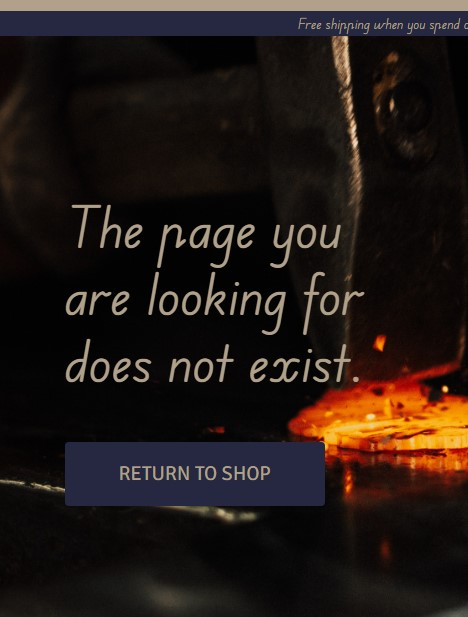

## Testing

### Validators

**HTML**

This html validation via [W3C HTML Validator](https://validator.w3.org/) was done on all html pages and returned the same result.

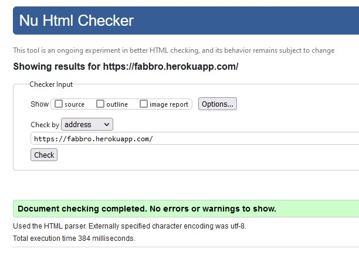

**CSS**

The CSS validation was done via [W3C CSS Validation Service](https://jigsaw.w3.org/css-validator/) and returned positive results.

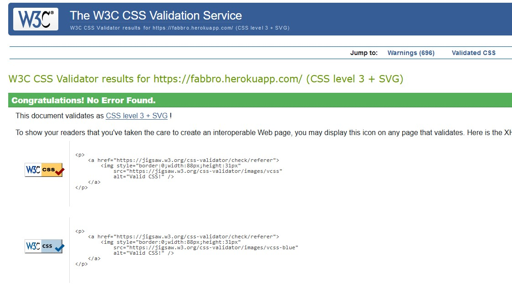

**JavaScript**

The JavaScript validation was done by copying all of the js used in the project into [jshint](https://jshint.com/), all at once, and came back positive.

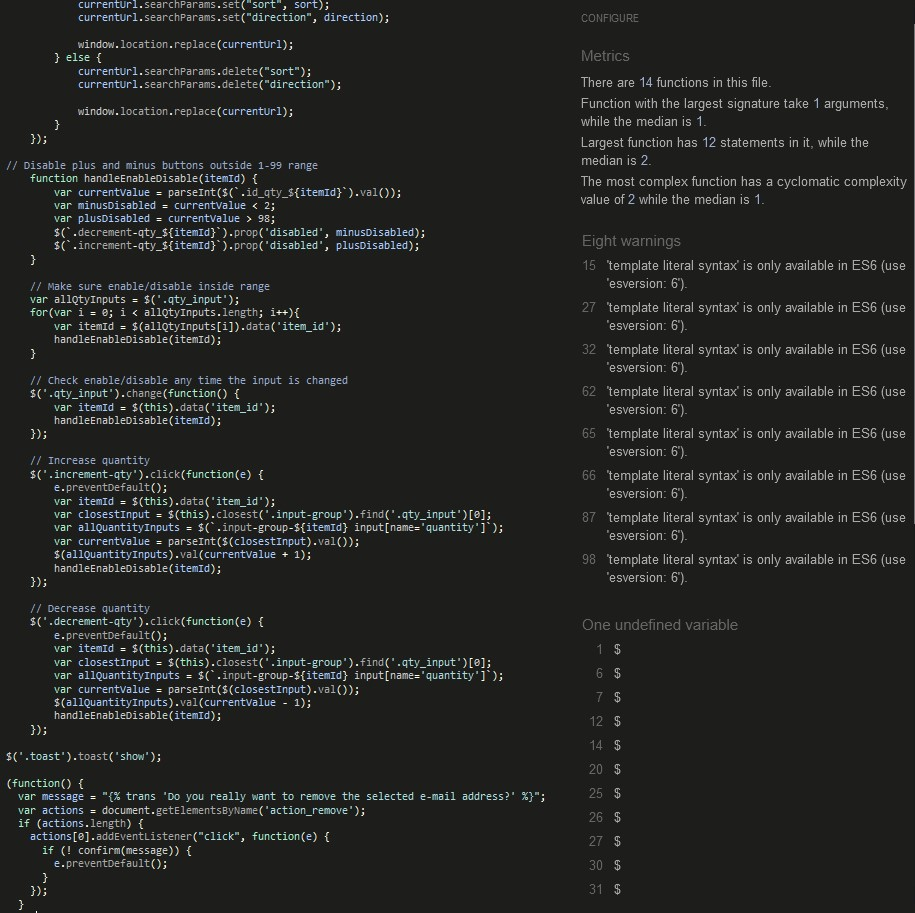

### Lighthouse tests 

Home on the desktop

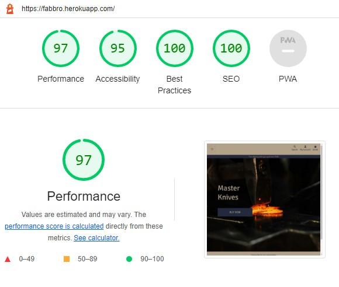

Home on mobile

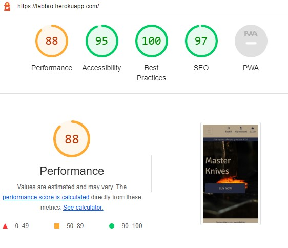

Product info on desktop

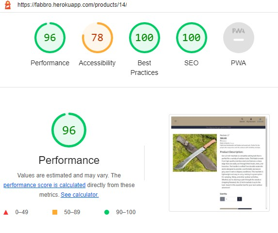

Product info on mobile

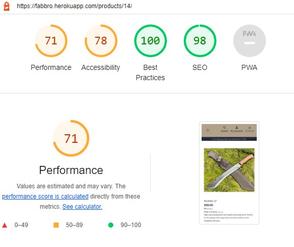

Lighthouse on other pages yielded similar results, for the future I would need to consider using a next-gen image format and a more uniform pattern for sizing the images in order to improve Lighthouse scores.

**Python**

Errors were checked for in python during writing as they would be pointed out in Gitpod's console. Also the errors shown on the local server while DEBUG was set to True in the project's *settings.py* file.

### Manual Testing

Behaviour Driven Development, is the process used to test user stories in a non-technical way. With that in mind a number of manual tests were completed to be sure that the app was functioning according to plan as well as to see if the responsiveness was working.

>1.  As a shopper, I want to be able to view a list of products so that I can select some to purchase.
    
Easily achieved when on the landing page all you need to do is click on the buy now button or go through the navbar and select All Products or whichever category you'd like to see.

>2. As a shopper, I want to be able to view individual product details so that I can identify price, description and image.

On whichever list of products the user is they can click on any individual product which will lead them to that product's info page where they will find all the details

>3. As a shopper, I want to be able to see deals and offers so that I can save on products I want to purchase.

On the nav bar there is a dropdown menu for deals, they function as planned

>4. As a shopper, I want to be able to view total of my purchase at any time so that I can avoid spending too much.

The basket is always visible in the top right corner of the page and it is updated in real time every time something is added or removed, it is functioning as intended

>5. As a shopper, I want to be able to sort the list of products so that I can identify products by different types of sorting.

Via navbar the user can select which specific categories they would like to view, the dropdown menus have the options

>6. As a shopper, I want to be able to sort a specific category of products so that I can find best-priced/rated product in a specific category or sort them by name.

At the top of the product list there is a sorting menu which works and allows users to sort the items on that page in a manner of different ways

>7. As a shopper, I want to be able to search a product by name or description so that I can find a specific product.

The search bar which also sits in the navbar functions correctly and seeks items which contain the entered query in their name or description, results are positive

>8. As a shopper, I want to be able to see what I've searched so that I can decide whether the product I want is available.

When using the search bar, a list of items is made and displayed on the page correctly, showing only relevant results

>9. As a shopper, I want to be able to select the quantity of a product when purchasing it so that I can ensure I don't accidentally select the wrong product quantity.

On the product info page the user can select the number for the quantity of products they want to add to the basket, as well as adjust it in the basket. These numbers are limited from 1 - 99, any number outside that range will not work

>10. As a user, I want to be able to register for an account so that I can have a personal profile.

Via the navbar link the user can register for an account which will store their information for future purchases

>11. As a user, I want to be able to login or logout so that I can access my personal account.

Via navbar links to sign in or sign out pages, the user can log back into their account whenever they want as well as log out, both working as intended

>12. As a user, I want to be able to recover my password in case I forget it so that I can recover access to my account.

On the sign in page, in case the user has forgotten their password there is a link which will help them recover it. They get an email sent to them with instructions. These functions work fine

>13. As a user, I want to be able to receive an email confirming registration so that I can verify my registration was successful.

Whenever a new user registers an account on the website, they get sent an email confirming the registration has been successful. Emails are being sent as planned

>14. As a user, I want to be able to have a user profile so that I can view my order history and confirmations, and save payment info.

When registered and having completed purchases, the user can visit their profile page via the navbar link, there all of their previous orders are registered and easily accessible. 

>15. As a superuser, I want to be able to add new products so that I can offer new products to sell.

The admin when logged in can see a unique option on his user dropdown menu on the navbar which allows him to go to a page in which he can add a new product via frontend

>16. As a superuser, I want to be able to delete products so that I can adjust the store according to available stock.

On the products list or on the product's individual page, the admin has unique options which will allow him to edit or delete an existing item, the links work well

>17. As a superuser, I want to be able to send newsletters so that I can inform our subscribers of new products and offers.

In the footer of the website, visible from every page, there is a link to a newsletter form where any one can click on and subscribe to newsletter. The emails get registered in the database

Exhaustive tests were also executed to try and find errors or missing links, the custom 404 page was able to catch attempts to access non-existing urls.

The Contact Us link in the footer works as intended and sends the user to a page with a Contact form in which they may leave their message, name and email. This is registered correctly in the database.

Both the newsletter and contact form were made by custom models.

Links to social media which are found in the footer work as intended and open a new tab for each one.

### Bugs

During development a few bugs were encountered.

These bugs were usually due to a typo somewhere in the code.

- Strange markings such as ('(",')") were appearing on personal details form when checking out. This was due to using commas when defining the fields in the code. 

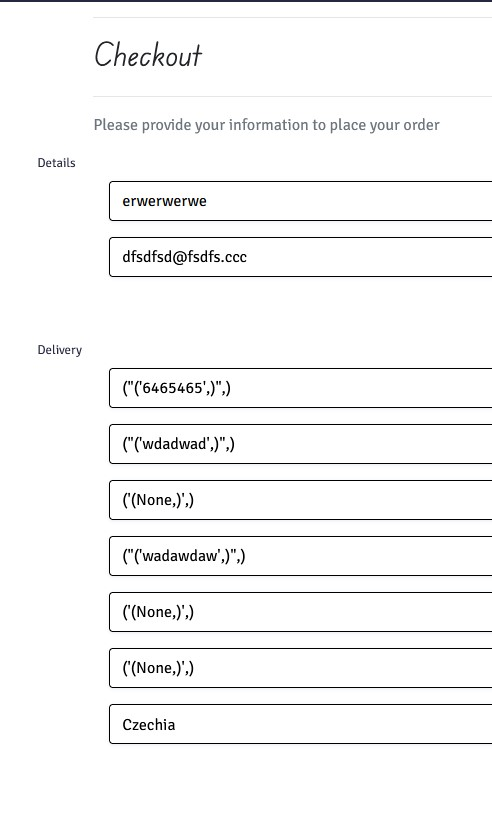

And this same bus led to the webhooks malfunctioning

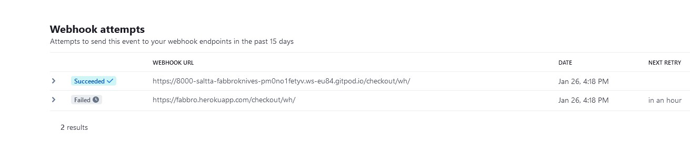

- When getting any toast message, if the basket had an item in it, the toast would show both the new message as well as the contents of the basket as it would when adding an item. 


This was fixed with a new if statement in the html that displays messages and adding `extra_tags` in the view responsible for messages regarding items in the basket

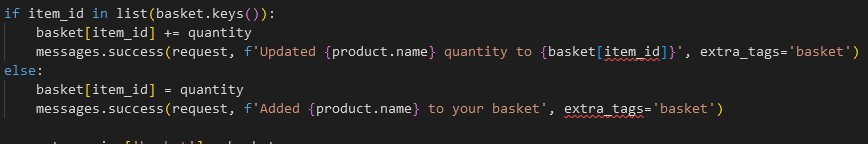

- The back to top arrown in the corner of the page was not showing up. The fix was to adjust its z-index.

- 500 errors happened because I would occasionally forget to migrate models.

- Heroku deployment failed. This was because I didn't use a capital letter P for Procfile.

- Users could exploit the basket by using the inspect tool on the browser to modify min and max numbers of allowed items in the basket.

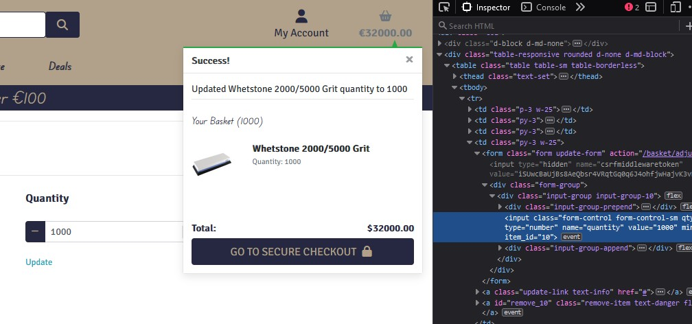

This was fixed by modifying the views in the basket app to perform server side validation.

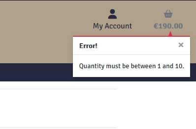

## Technologies Used

- Gitpod
- Github
- Heroku
- ElephantSQL
- Stripe
- AWS

### Languages

- HTML5
- CSS3
- Python
- JavaScript

### Libraries / Frameworks

- Django
- Bootstrap
- FontAwesome

### Resources

- Code Institute walkthrough
- [Django documentation](https://www.djangoproject.com/)
- [W3Schools](https://www.w3schools.com/)
- [Bootstrap documentation](https://getbootstrap.com/)
- [Stack Overflow](https://stackoverflow.com/)
- Articles

## Deployment

### Developing

1. Create a new repository on GitHub using Code Institute's [Gitpod Full Template](https://github.com/Code-Institute-Org/gitpod-full-template).
1. Open the repository you just created and from there you can:
    * Create a workspace by prefixing any GitHub URL with gitpod.io/#, or
    * By using Gitpod browser extension, it adds a button to GitHub.
1. Through Gitpod you will push your commits straight to GitHub.

### Deployment to heroku

**In your app** 

1. add the list of requirements by writing in the terminal "pip3 freeze --local > requirements.txt"
2. Git add and git commit the changes made

**Log into heroku**

3. Log into [Heroku](https://dashboard.heroku.com/apps) or create a new account and log in

4. top right-hand corner click "New" and choose the option Create new app, if you are a new user, the "Create new app" button will appear in the middle of the screen

5. Write app name - it has to be unique, it cannot be the same as this app
6. Choose Region - I am in Europe
7. Click "Create App"

**The page of your project opens.**

8. Go to Resources Tab, Add-ons, search and add Heroku Postgres

9. Choose "settings" from the menu on the top of the page

10. Go to section "Config Vars" and click button "Reveal Config Vars". 

11. Add the below variables to the list

    * Database URL from  ElephantSQL will be added manually.  
    * Secret_key - use a free key generator online.


**Go back to code**

12. Procfile needs to be created in your app
```
web: gunicorn <PROJECT_NAME>.wsgi:application
```

13. In settings in your app add Heroku to ALLOWED_HOSTS

14. Add and commit the changes in your code and push to github

**Final step - deployment**

15. Next go to "Deploy" in the menu bar on the top 

16. Go to section "deployment method", choose "GitHub"

17. New section will appear "Connect to GitHub" - Search for the repository to connect to

18. type the name of your repository and click "search"

19. once Heroku finds your repository - click "connect"

20. Scroll down to the section "Memual Deploys"

21. Click choose "Deploy branch" and manually deploy

22. Click "Deploy branch"

Once the program runs:
you should see the message "the app was sussesfully deployed"

23. Click the button "View"

The live link can be found [here](https://fabbro.herokuapp.com/)

### Setting up your local enviroment

1. Create Virtual enviroment on your computer or use gitpod built in virtual enviroment feature.

2. Create env.py file.

* Database URL can be obtained from [heroku](https://dashboard.heroku.com/), add ElephantSQL as an add on when creating an app. 
* Secret_key - Can be generated via free key generator online.

```
DEVELOPMENT
SECRET_KEY

STRIPE_PUBLIC_KEY
STRIPE_SECRET_KEY 
STRIPE_WH_SECRET

```
ElephantSQL and AWS keys are needed only on Heroku, not in local IDE

3. Run command
```
pip3 install -r requirements.txt
````

### Getting Stripe keys

Go to developers tab. On side menu you will find API keys. Copy STRIPE_PUBLIC_KEY and STRIPE_SECRET_KEY.

- Go to Webhooks. Click Add Endpoint button in top right hand corner.
- Add endpoint URL (your local or deployed URL)
- Add all events 
- Click add endpoint

You should be redirected to this webhook's page. Reveal webhook sign in secret and copy to Settings and to heroku as STRIPE_WH_SECRET variable

### Getting email variables from gmail

- Log into gmail account
- Go to **Settings** and than **See all settings**
- On the top menu go to Accounts and import
- Find on the list Other google account settings
- Left side menu - Security
- Turn on two step verification: add phone number and follow instructions
- Go back to security App passwords - Select Mail, Select Device - Other, Django, Copy app password.

In Heroku :

- EMAIL_HOST_PASS is the password copied from above.
- EMAIL_HOST_USER is the gmail email address.

### Heroku Config Vars

|     Variable name     |                           Value/where to find value                           |
|:---------------------:|:-----------------------------------------------------------------------------:|
| AWS_ACCESS_KEY_ID     | AWS CSV file(instructions below)                                               |
| AWS_SECRET_ACCESS_KEY | AWS CSV file(instructions below)                                               |
| DATABASE_URL          | Postgres generated from ElephantSQL                                        |
| EMAIL_HOST_PASS       | Password from email client                                                    |
| EMAIL_HOST_USER       | Site's email address                                                          |
| SECRET_KEY            | Random key generated as above                                                 |
| STRIPE_PUBLIC_KEY     | Stripe Dashboard > Developers tab > API Keys > Publishable key                |
| STRIPE_SECRET_KEY     | Stripe Dashboard > Developers tab > API Keys > Secret key                     |
| STRIPE_WH_SECRET      | Stripe Dashboard > Developers tab > Webhooks > site endpoint > Signing secret |
| USE_AWS               | True (when AWS set up - instructions below)                                   |

### AWS S3 Bucket

- Create an AWS account.
- From the 'Services' tab on the AWS Management Console, search 'S3' and select it.
- Click 'Create a new bucket', give it a name(match your Heroku app name if possible), and choose the region closest to you.
- Under 'Object Ownership' select 'ACLs enabled' and leave the Object Ownership as Bucket owner preferred.
- Uncheck block all public access and acknowledge that the bucket will be public.
- Click 'Create bucket'.
- Open the created bucket, go to the 'Properties' tab. Scroll to the bottom and under 'Static website hosting' click 'edit' and change the Static website hosting option to 'enabled'. Copy the default values for the index and error documents and click 'save changes'.
- Open the 'Permissions' tab, locate the CORS configuration section and add the following code:
```
[
  {
      "AllowedHeaders": [
          "Authorization"
      ],
      "AllowedMethods": [
          "GET"
      ],
      "AllowedOrigins": [
          "*"
      ],
      "ExposeHeaders": []
  }
]
```
- In the 'Bucket Policy' section and select 'Policy Generator'.
- Choose 'S3 Bucket Policy' from the type dropdown.
- In 'Step 2: Add Statements', add the following settings:
    - Effect: Allow
    - Principal: *
    - Actions: GetObject
    - ARN: Bucket ARN (copy from S3 Bucket page)
- Click 'Add Statement'.
- Click 'Generate Policy'.
- Copy the policy from the popup that appears
- Paste the generated policy into the Permissions > Bucket Policy area.
- Add '/*' at the end of the 'Resource' key, and save.
- Go to the 'Access Control List' section click edit and enable List for Everyone (public access) and accept the warning box.

### IAM
- From the 'Services' menu, search IAM and select it.
- Once on the IAM page, click 'User Groups' from the side bar, then click 'Create group'. Choose a name and click 'Create'.
- Go to 'Policies', click 'Create New Policy'. Go to the 'JSON' tab and click 'Import Managed Policy'. 
- Search 'S3' and select 'AmazonS3FullAccess'. Click 'Import'.
- Get the bucket ARN from 'S3 Permissions' as per above.
- Delete the '*' from the 'Resource' key and add the following code into the area:

```
"Resource": [
    "YOUR-ARN-NO-HERE",
    "YOUR-ARN-NO-HERE/*"
]
```

- Click 'Next Tags' > 'Next Review' and then provide a name and description and click 'Create Policy'.
- Click'User Groups' and open the created group. Go to the 'Permissions' tab and click 'Add Permissions' and then 'Attach Policies'.
- Search for the policy you created and click 'Add Permissions'.
- You need to create a user to put in the group. Select users from the sidebar and click 'Add user'.
- Give your user a user name, check 'Programmatic Access'.
- Click 'Next' and select the group you created.
- Keep clicking 'Next' until you reach the 'Create user' button and click that.
- Download the CSV file which contains the AWS_SECRET_ACCESS_KEY and your AWS_ACCESS_KEY_ID needed in the Heroku variables as per above list and also in your env.py.

### Connecting S3 to Django 
- Go back to your IDE and install 2 more requirements:
    - `pip3 install boto3`
    - `pip3 install django-storages` 
- Update your requirements.txt file by typing `pip3 freeze --local > requirements.txt` and add storages to your installed apps.
- Create an if statement in settings.py 

```
if 'USE_AWS' in os.environ:
    AWS_STORAGE_BUCKET_NAME = 'insert-your-bucket-name-here'
    AWS_S3_REGION_NAME = 'insert-your-region-here'
    AWS_ACCESS_KEY_ID = os.environ.get('AWS_ACCESS_KEY_ID')
    AWS_SECRET_ACCESS_KEY = os.environ.get('AWS_SECRET_ACCESS_KEY')

```
- Then add the line 

    - `AWS_S3_CUSTOM_DOMAIN = f'{AWS_STORAGE_BUCKET_NAME}.s3.amazonaws.com'` to tell django where our static files will be coming from in production.


- Create a file called custom storages and import both our settings from django.con as well as the s3boto3 storage class from django storages. 
- Create the following classes:

```
class StaticStorage(S3Boto3Storage):
    location = settings.STATICFILES_LOCATION

class MediaStorage(S3Boto3Storage):
    location = settings.MEDIAFILES_LOCATION
```

- In settings.py add the following inside the if statement:

```
STATICFILES_STORAGE = 'custom_storages.StaticStorage'
STATICFILES_LOCATION = 'static'
DEFAULT_FILE_STORAGE = 'custom_storages.MediaStorage'
MEDIAFILES_LOCATION = 'media'
STATIC_URL = f'https://{AWS_S3_CUSTOM_DOMAIN}/{STATICFILES_LOCATION}/'
MEDIA_URL = f'https://{AWS_S3_CUSTOM_DOMAIN}/{MEDIAFILES_LOCATION}/'

```

- and then add the following at the top of the if statement:
```
AWS_S3_OBJECT_PARAMETERS = {
    'Expires': 'Thu, 31 Dec 2099 20:00:00 GMT',
    'CacheControl': 'max-age=94608000',
}
```

- Go to S3, go to your bucket and click 'Create folder'. Name the folder 'media' and click 'Save'.
- Inside the folder, click 'Upload', 'Add files', and then select all the images that you are using for your site.
- Then under 'Permissions' select the option 'Grant public-read access' and click upload.
- Your static files and media files should be automatically linked from django to your S3 bucket.


## Credits

- [aaknives](https://aaknives.eu/en/shop/?product_cat=uncategorized&filter=1   ) - Outdoor knives photos
- [Zakharov](https://www.zakharov.com.br/) - Kitchen knives photos
- [Smoke and Pork](https://smokeandpork.ie) - Sharpener
- [Brennan Catering Supplies](https://www.brennancateringsupplies.ie/Dual-Whetstone.html) - Whetstone, knife block, magnet and pans photos
- [TOG Knives](https://www.togknives.com/product/the-hare/) - Cutting boards photos
- [Freepik](https://www.freepik.com/) - No image placeholder photo
- [Color Hexa](https://www.colorhexa.com/) - Color scheme
