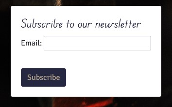

# Fabbro Knives

## Intro

Fabbro Knives is a B2C e-commerce website for the final project of the Code Institute diploma in Software Development.

The site provides role based permissions for users to interact with a central dataset. It includes user authentication, email validation and CRUD functionality for administrator users.

The payment system uses Stripe. Please note that this website is for educational purposes only and the payment gateway is not set up to accept real payments. Do not enter any personal credit/debit card details when using the site.

When testing the site, please use the following from Stripe's testing documentation:

- a Stripe test card number, such as 4242 4242 4242 4242, or 4000 0582 6000 - 0005 for UK.
- any future expiry date.
- any three-digit CVC.

You can visit Fabbro Knives by [clicking here](https://fabbro.herokuapp.com)

# UX

## Strategy

The main strategy is to target the niche audience who are passionate about cooking and love to use quality tools in their kitchen. Here are the following strategies that can help to grow the business:

- Create a user-friendly website: The website should be easy to navigate and visually appealing. It should provide a seamless shopping experience for customers, with clear product descriptions and high-quality images.

- Focus on quality products: Quality products are the backbone of any ecommerce business. It is important to ensure that the products being sold are of the highest quality and meet the expectations of the customers.

- Offer a wide range of products: Offering a variety of products such as different types of knives, cutting boards, pans and knife maintenance accessories will give customers more choices and increase the likelihood of them making a purchase.

- Use social media to promote products: Social media platforms such as Facebook, Instagram and Twitter can be used to promote products and engage with customers. This will help to build a community of loyal customers and increase brand awareness.

- Provide excellent customer service: Excellent customer service is key to the success of any ecommerce business. Providing prompt and helpful responses to customer inquiries and concerns can help to build a good reputation and increase customer loyalty.

- A newsletter can be an effective strategy to increase engagement with customers and keep them updated on new products, promotions, and industry news. By implementing a newsletter, an ecommerce business can increase customer engagement and retention, which can ultimately lead to increased sales and revenue.

## Business Plan

Fabbro Knives operates on a direct-to-consumer model, meaning that it sells its products directly to customers without the need for intermediaries. This allows it to offer competitive prices for high-quality products, as it is able to cut out the middleman and reduce costs.

The target audience consists of cooking enthusiasts, professional chefs, and anyone interested in high-quality kitchen products. We believe that our products are ideal for customers who value quality and durability, and are willing to invest in products that will last for years to come. We also aim to target gift buyers, as high-end kitchen products make for great gifts.

### Products

Our e-commerce store offers a wide range of products, including:

- Knives: Chef's knives, hunting knives, cleavers, and more.
- Pans: Saucepans, stainless steel, non-stick, and more.
- Cutting boards: High quality handmade wood boards and maintenance balm.
- Sharpeners: Compact sharpener and whetstones.
- Storage: Wood knife block and a magnetic holder.

All of our products are sourced from reputable brands and manufacturers, and are chosen for their quality and durability. We believe that our products are the best in the market, and we stand behind every product we sell.

### Pricing

Our pricing strategy is to be competitive with other high-end kitchen stores, while also taking into account the cost of sourcing and shipping our products. We regularly review our prices to ensure that they are in line with the market, and we offer occasional discounts or bundles to incentivize purchases.

### Marketing Strategies

We use a variety of marketing strategies to promote our e-commerce store and products:

- Social media: We maintain a presence on popular social media platforms such as Instagram, Facebook, and Twitter. We regularly post updates about new products, promotions, and events to engage with our audience and build our brand.
- Search engine optimization (SEO): We optimize our website to rank higher on search engines such as Google, so that customers can find us more easily when searching for kitchen products.
- Email marketing: We send regular emails to our subscribers to inform them of new products, promotions, and events. We also offer exclusive discounts to our email subscribers to encourage purchases.
- Paid advertising: We use paid advertising on platforms such as Google Ads and Facebook Ads to target customers who may be interested in our products. We regularly review the performance of our ads to ensure that they are effective.

### Conclusion

Thank you for considering Fabbro Knives for your kitchen product needs. We are committed to providing the best products and shopping experience for our customers, and we hope that you will enjoy shopping with us. If you have any questions or feedback, please don't hesitate to contact us.

## Scope

### User Expectations

- As a user I expect the app to be accessible.
- As a user I expect my data to be secure.
- As a user I expect the app to be responsive.

### User Stories

- As a shopper, I want to be able to view a list of products so that I can select some to purchase.
- As a shopper, I want to be able to view a list of products so that I can select some to purchase.
- As a shopper, I want to be able to see deals and offers so that I can save on products I want to purchase.
- As a shopper, I want to be able to view total of my purchase at any time so that I can avoid spending too much.
- As a shopper, I want to be able to sort the list of products so that I can identify products by different types of sorting.
- As a shopper, I want to be able to sort a specific category of products so that I can find best-priced/rated product in a specific category or sort them by name.
- As a shopper, I want to be able to search a product by name or description so that I can find a specific product.
- As a shopper, I want to be able to see what I've searched so that I can decide whether the product I want is available.
- As a shopper, I want to be able to select the quantity of a product when purchasing it so that I can ensure I don't accidentally select the wrong product quantity.
- As a user, I want to be able to register for an account so that I can have a personal profile.
- As a user, I want to be able to login or logout so that I can access my personal account.
- As a user, I want to be able to recover my password in case I forget it so that I can recover access to my account.
- As a user, I want to be able to receive an email confirming registration so that I can verify my registration was successful.
- As a user, I want to be able to have a user profile so that I can view my order history and confirmations, and save payment info.
- As a superuser, I want to be able to add new products so that I can offer new products to sell.
- As a superuser, I want to be able to delete products so that I can adjust the store according to available stock.
- As a superuser, I want to be able to send newsletters so that I can inform our subscribers of new products and offers.

### Features

- Responsive Design - easy to access and view on multiple devices
- User Interaction - users can add products to their basket and adjust quantity
- Newsletter - any user can subscribe to newsletters
- Registration - links for the users to register, login and logout
- Checkout - users can pay securely and complete their purchase
- Contact - users can contact the store for more information

## Structure

### Pages

- The site contains home page
- There is a page for all products
- There are pages for each category
- There are registration, login and logout pages
- There is a page for the user profile
- There is a page for the basket
- There is a page for checkout
- There is a page for the contact form
- There is a page for the newsletter subscription

### Code

- The website was built using Django
- The website uses templates
- The website has one main app and multiple others based on functionality

### Database

- The website uses ElephantSQL connected to Heroku

### Database plan

Made with drawSQL:

**Implementing User Stories**

>1. View list of products

* Clicking on 'Buy Now' on the main page or the links in the nav bar up top can take the user to pages where the products are displayed

>2. Product Details

* Users can click on a product and open up its own individual page with more information and the option to add it to the basket

>3. See offers

* Users can select from the nav bar to view products that are on sale

>4. Basket total

* Users can see their total at any time from any page on the upper right corner of the page

>5. Register account

* Users have the option to register for an account by following the link in the nav bar

>6. Login/Logout

* Users can opt to log back into their accounts or log out of them through links in the nav bar

>7. Recover password

* Users that are registered but have forgotten their password detail may follow a link on the sign in page

>8. Email register confirmation

* Users receive an email confirmation when they register

>9. User profile

* Users that are registered have the option to visit their own profile page where they can update their information and view previous orders

>10. Sort products

* Users can sort products by different specifications such as price or alphabetical order

>11. Category sorting

* Users can follow links on the nav bar to find products of a specific category

>12. Search by name or description

* Users can input their own query into the search in the nav bar and find proucts by their names or description

>13. See search result

* Users can view a list of items that match their search query

>14. Product quantity

* Users can select a specific quantity of the product they wish to buy without having to add one by one

>15. Add new products

* Admin can add new products via the frontend of the webiste by following the link on the nav bar

>16. Remove products

* Admin can choose to remove a product either from the list of products or the product page

>17. Newsletter

* Admin can send out news and offers to users that have subscribed

## Skeleton

**Wireframes**

Home page - where the user should find a navbar and footer.

Products - where the user can see listed products

Basket - where added products are stored for purchase

Profile - where personal info and previews orders can be seen

Checkout - where users can complete their purchase

## Surface

**Design**

The layout of the website is functional and simple to navigate. It minimizes the amount of time the user has to worry about looking for links, the navbar should clearly displayed and accessible. The products should be clearly presented, organized and easy to click to access more details. 

The colour choice was based on a more elegant approach by using darker tones contrasted with white so as to not become too confusing and distracting. The colours are a complement to the products and not the main focus.

 

**Images**

The images should represent the products. Since this is only an educational project and not a real store, they were sourced from actual sellers credited at the end of this Readme.

## Features

### Navigation

The nav bar allows users to search for products, sort them by categories, login/logout, view profile, register and view basket.

The footer allows users to Subscribe, Contact te store or follow the links to the store's social media.

Users can contact the store for more information

Users can subscribe to the store's newsletter

Users can view listed products

Users can view individual product info

Users can sign up

Users can sign in

Users can see the contents of their basket when they add a product

Users get confirmation through messages in the upper right corner

Users can checkout

Users get an order confirmation when completing a purchase

Users can see their details and completed orders on their profiel page

Admin can edit and delete products

Admin can add products

